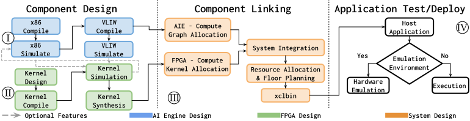

# VOTED: Versal-Optimization-Toolkit-for-Education-ed-Heterogeneous-System-Development
## 🎯 Info & Description
This repository contains code and automation for VOTED, a toolkit for education, development and optimization of Versal systems. 
Voted idea is to follow a bottom-up approach to develop from low level kernels up to the system integration. 



_VOTED’s modular structure. Users start from I and II . VOTED provides comprehensive evaluation strategies to
every single component correctness even integrated with the output of other components. Then, the system-level module III
instantiates and links the devised components, allowing experts to guide the resource allocation strategy. Finally, VOTED offers
a ready-to-use host structure IV , to perform hardware emulation or to target the accelerator card for deploying._


## 🗂️ Main Structure

**🧠 aie** - contains the code for AI Engine kernels.  
**𒁈 fpga** - contains the PL component.  
**📁 common** - contains some useful included constants and headers.  
**🔗 linking** - contains the cfg file requiered to connect your components.  
**💻 sw** - contains the software for your application.  

### 🧠 aie
data - contains the input source for your simulation.  
src - contains the code.  

**Main Commands**

_make aie_compile_x86_ : compile your code for x86 architecture.  
_make aie_simulate_x86_ : simulate your x86 architecture.  
_make aie_compile SHELL_NAME=< qdma|xdma >_ : compile your code for VLIW architecture, as your final hardware for HW ad HW_EMU. 
_make aie_simulate_ : simulate your code for VLIW architecture, as your final hardware.  
_make clean_ : removes all the output file created by the commands listed above.  

### 𒁈 FPGA

testbench : it contains a testbench for each kernel

**Main Commands**

_make compile TARGET=HW/HW_EMU_ _SHELL_NAME=< qdma|xdma >_ : it compiles all your kernel, skipping the ones already compiled.  
_make run_testbench_setup_aie_ : compiles and execute the testbench for the kernel setup_aie.  
_make run_testbench_sink_from_aie_ : compiles and execute the testbench for the kernel setup_aie.  

### 🔗 linking

Contains the cfg file required to link the components. For the Versal case, you have also to link the AI Engine.

**Main Commands**

_make all TARGET=HW/HW_EMU SHELL_NAME=< qdma|xdma >_  : it builds the hardware or the hardware emu linking your componentsEMU TARGET=HW/HW_EMU
make clean: it removes all files.

### 💻 Sw

Once you have devised your accelerator, you need to create the host code for using it. Notice that the presented example is a minimal host code, which may be improved using all the capabilities of C++ code ( classes, abstraction and so on).

**Main Commands**
_make build_sw_ : it compiles the sw

_./setup_emu.sh -s on --shell =< qdma|xdma >_ : enables the hardware emulation

For execution: 

```
./host_overlay.exe : `<XCLBIN_PATH>` 
```

this will compile, prepare the emulation, and run it.


## 🛠️ General useful commands:
If you need to move your bitstream and executable on the target machine, you may want it prepared in a single folder that contains all the required stuff to be moved. In this case, you can use the

_make build_and_pack TARGET=hw/hw_emu SHELL_NAME=< qdma|xdma >_ :  it allows you to pack our build in a single folder. Notice that the hw_emu does not have to be moved on the device, it must be executed on the development machine.

## 🚀 Additional Desired Features:

### Target Non Versal Accelerator Cards
In principle, VOTED is not meant for Versal systems only, as it can target also FPGA HPC accelerators, by applying few modifications to the basecode. 

Suggested steps: 
1. Modify _linking/Makefile_ as described in comments, thus removing the XSA_OBJ dependency
2. Add your custom HLS kernels in _./fpga/_ and add the needed makefiles rule to compile. 
3. Edit the _linking/xclbin_overlay.cfg_ to remove the AI Engine dependency

Checkout VOTED forks on 3D Mutual Information Accelerator targeting U55C accelerator cards with HBM :D 

### AI Engine Template Generation
This is still an under development feature, it can be found in aie_template_generator branch

## Related Pubblications

- G. Sorrentino, P. S. Galfano, E. D'Arnese and D. Conficconi, "Soaring with TRILLI: An HW/SW Heterogeneous Accelerator for Multi-Modal Image Registration," in 2025 IEEE 33rd Annual International Symposium on Field-Programmable Custom Computing Machines (FCCM), Fayetteville, AR, USA, 2025, pp. 56-65, doi: 10.1109/FCCM62733.2025.00040.

- Cabai, E., Sorrentino, G., & Santambrogio, M. D., Conficconi, D.(2025). A Hardware/Software Co-Design Approach for Versal-Based K-means Acceleration [Poster]. In Proceedings of the 2024 IEEE International Parallel and Distributed Processing Symposium Workshops (IPDPSW). IEEE.

- Mansutti, F., Ettori, D., Sorrentino, G., Santambrogio, M. D., & Conficconi, D. (2025). Towards a Methodology to Leverage Alveo Versal System Usability And Parallelization [Poster]. In Proceedings of the 39th I Reconfigurable Architectures Workshop (RAW 2025).

- P. S. Galfano, G. Sorrentino, E. D'Arnese and D. Conficconi, "Co-Designing a 3D Transformation Accelerator for Versal-Based Image Registration," 2024 IEEE 42nd International Conference on Computer Design (ICCD), Milan, Italy, 2024, pp. 219-222, doi: 10.1109/ICCD63220.2024.00041.

## Citation
```
@INPROCEEDINGS{sorrentino2025voted,
  author={Sorrentino, Giuseppe and Galfano, Paolo S. and D’Arnese, Eleonora and Conficconi, Davide},
  booktitle={2025 IEEE International Symposium on Circuits and Systems (ISCAS)}, 
  title={VOTED – Versal Optimization Toolkit for Education and Heterogeneous Systems Development}, 
  year={2025},
  volume={},
  number={},
  pages={1-5},
  doi={10.1109/ISCAS56072.2025.11043842}}
```
